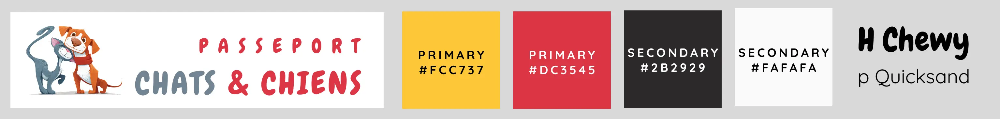
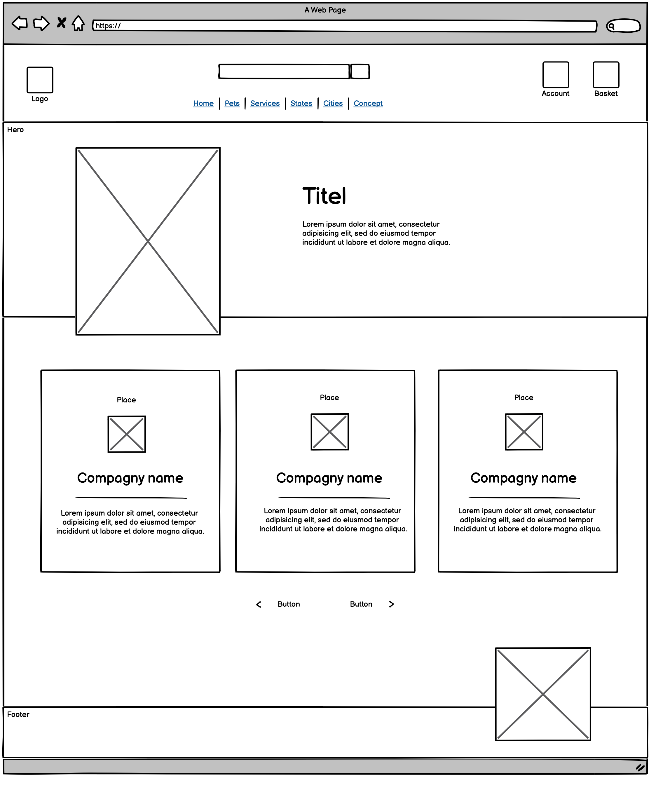
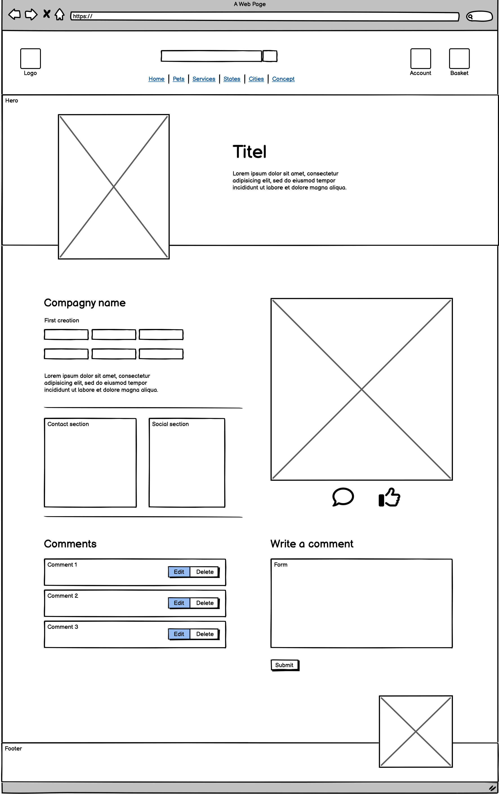
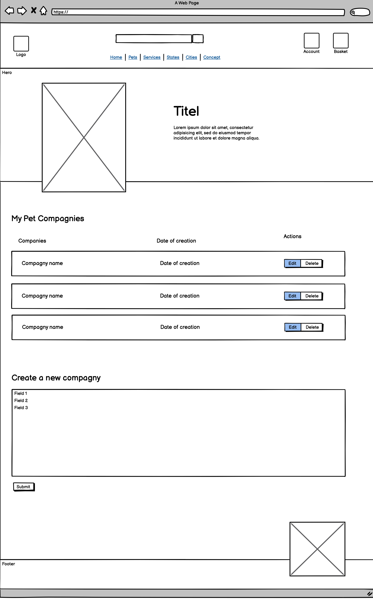
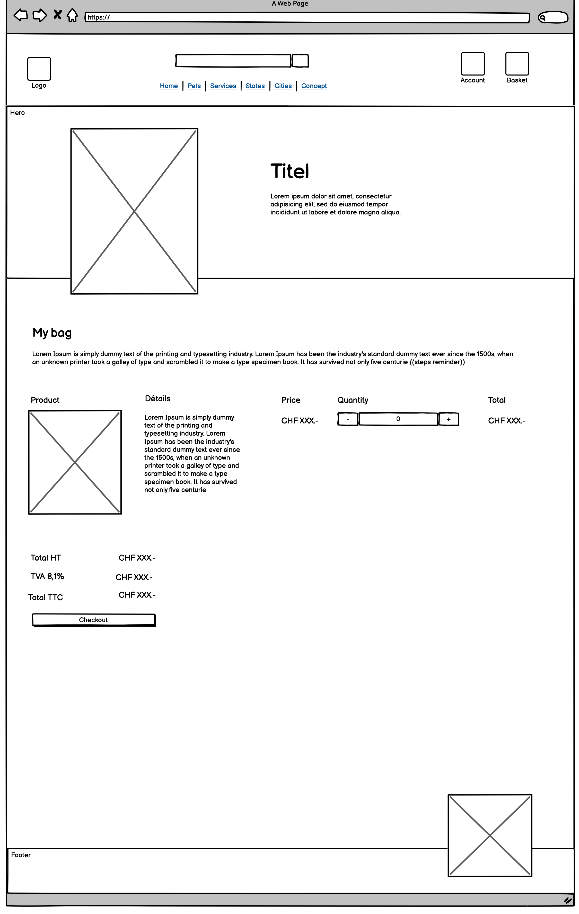
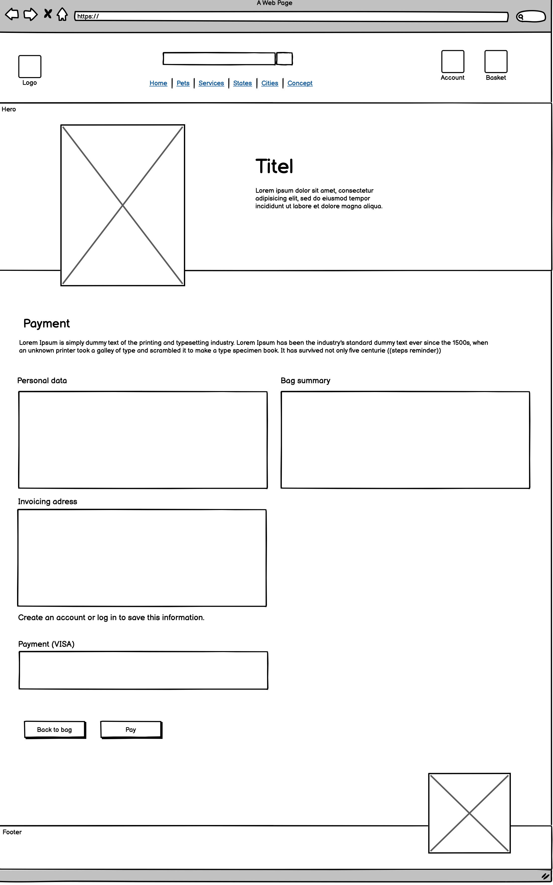
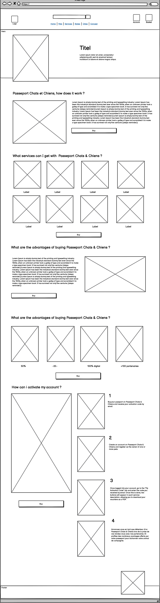
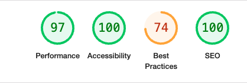
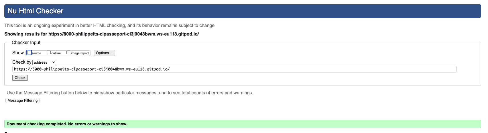
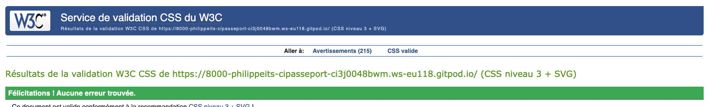

# Passeport Chats & Chiens

<a style="text-decoration:underline;" target="_blank" href="https://ci-portfolio5-ecommerce-c17f2cdd891e.herokuapp.com/">Passeport Chats & Chiens LIVE link</a> 
<a style="text-decoration:underline;" target="_blank" href="https://github.com/PhilippeItsMe/ci-passeport-chats-et-chiens-portfolio5-v2.git">Passeport Chats & Chiens GITHUB link</a>

## Project
Imagine a world where caring for your beloved pet becomes easier, more affordable, and oh-so-rewarding! Our platform is here to connect passionate pet owners with trusted businesses that cater to every furry, feathery, or scaly need. For just a small annual fee, you'll unlock exclusive perks: enjoy a fabulous 50% discount on your first purchase and a delightful CHF 20 off on your second visit—per business. Because your pet deserves the very best, and so do you! 

## Design
To establish a consistent and eye-catching design, the logo, primary and secondary colors, and the following fonts have been defined for this site. Additionally, wireframes of the three main pages have been created using Balsamiq.

**Home page (pet_business_list.html)**

**Company detailed presentation (pet_business_detail.html)**

**Companies presentation management (pet_business_form.html)**

**My Bag page (bag.html)**

**Checkout page (checkout.html)**

**Concept page (concept.html)**

## Key features

The following table outlines the features included in this project. Their deployment is divided between Project 4 and Project 5, with Project 4 serving as a Minimum Viable Product (MVP) and Project 5 encompassing the full-scale implementation.

  <table border="1" cellpadding="10" cellspacing="0">
    <thead style="background-color:white; color:black">
        <tr style="background-color:RGB(249, 249, 249, 0.1)">
            <th style="width:70%"> <strong>Features</strong></th>
            <th style="width:15%; text-align:center;"><strong>Project 5</strong></th>
            <th style="width:15%; text-align:center;"><strong>Future developments</strong></th>
        </tr>
    </thead>
    <tbody>
        <tr>
            <td colspan="3" style="background-color:RGB(249, 249, 249, 0.1)"><strong>For Partners (Business Owners / Service Providers)</strong></td>
        </tr>
        <tr>
            <td colspan="3"><strong>User Account Management</strong></td>
        </tr>
        <tr>
            <td style="padding-left: 50px;">Create an account using email and password</td>
            <td style="text-align:center;">✔</td>
            <td style="text-align:center;"></td>
        </tr>
        <tr>
            <td style="padding-left: 50px;">Confirm registration via email verification</td>
            <td style="text-align:center;">✔</td>
            <td style="text-align:center;"></td>
        </tr>
        <tr>
            <td style="padding-left: 50px;">Log in using email and password</td>
            <td style="text-align:center;">✔</td>
            <td style="text-align:center;"></td>
        </tr>
        <tr>
            <td style="padding-left: 50px;">Reset password</td>
            <td style="text-align:center;">✔</td>
            <td style="text-align:center;"></td>
        </tr>
        <tr>
            <td style="padding-left: 50px;">Option to log in via social account (social login)</td>
            <td style="text-align:center;"></td>
            <td style="text-align:center;">✔</td>
        </tr>
        <tr>
            <td colspan="3"><strong>Business Management</strong></td>
        </tr>
        <tr>
            <td style="padding-left: 50px;">Create a business profile (product sales or service offerings)</td>
            <td style="text-align:center;">✔</td>
            <td style="text-align:center;"></td>
        </tr>
        <tr>
            <td style="padding-left: 50px;">Edit, update, or delete the business profile</td>
            <td style="text-align:center;">✔</td>
            <td style="text-align:center;"></td>
         <tr>
            <td colspan="3"><strong>Dashboards</strong></td>
        </tr>
        <tr>
            <td style="padding-left: 50px;">Track vouchers downloaded related to your business</td>
            <td style="text-align:center;"></td>
            <td style="text-align:center;">✔</td>
        </tr>
         <tr>
            <td style="padding-left: 50px;">View statistics on how often your business profiles have been viewed</td>
           <td style="text-align:center;"></td>
            <td style="text-align:center;">✔</td>
        </tr>
        <tr>
            <td colspan="3" style="background-color:RGB(249, 249, 249, 0.1)"><strong>For Pet Owners</strong></td>
        </tr>
         <tr>
            <td colspan="3"><strong>User Account Management</strong></td>
        </tr>
        <tr>
            <td style="padding-left: 50px;">Create an account using email and password</td>
            <td style="text-align:center;">✔</td>
            <td style="text-align:center;"></td>
        </tr>
        <tr>
            <td style="padding-left: 50px;">Confirm registration via email verification</td>
            <td style="text-align:center;">✔</td>
            <td style="text-align:center;"></td>
        </tr>
        <tr>
            <td style="padding-left: 50px;">Log in using email and password</td>
            <td style="text-align:center;">✔</td>
            <td style="text-align:center;"></td>
        </tr>
        <tr>
            <td style="padding-left: 50px;">Reset password</td>
            <td style="text-align:center;">✔</td>
            <td style="text-align:center;"></td>
        </tr>
        <tr>
            <td style="padding-left: 50px;">Option to log in via social account (social login)</td>
            <td style="text-align:center;"></td>
            <td style="text-align:center;">✔</td>
        </tr>
        <tr>
            <td colspan="3"><strong>Service Usage</strong></td>
        </tr>
          <tr>
            <td style="padding-left: 50px;">Purchase passports for cats and dogs</td>
            <td style="text-align:center;">✔</td>
            <td style="text-align:center;"></td>
        </tr>
          <tr>
            <td style="padding-left: 50px;">Receive activation codes by email</td>
            <td style="text-align:center;">✔</td>
            <td style="text-align:center;"></td>
        </tr>
          <tr>
            <td style="padding-left: 50px;">Activate your activation code</td>
            <td style="text-align:center;">✔</td>
            <td style="text-align:center;"></td>
        </tr>
          <tr>
            <td style="padding-left: 50px;">Download vouchers (50% off or CHF -20) only if an activation code has been registered</td>
            <td style="text-align:center;">✔</td>
            <td style="text-align:center;"></td>
        </tr>
          <tr>
            <td style="padding-left: 50px;">Search for services using keywords</td>
            <td style="text-align:center;">✔</td>
            <td style="text-align:center;"></td>
        </tr>
          <tr>
            <td style="padding-left: 50pxx;">Filter services by categories: type of animal, service type, canton, and locations</td>
            <td style="text-align:center;">✔</td>
            <td style="text-align:center;"></td>
        </tr>
        <tr>
            <td colspan="3"><strong>Interactions with Partners</strong></td>
        </tr>
          <tr>
            <td style="padding-left: 50px;">Like or unlike partner businesses</td>
            <td style="text-align:center;">✔</td>
            <td style="text-align:center;"></td>
        </tr>
          <tr>
            <td style="padding-left: 50px;">Add and manage comments on partner businesses</td>
            <td style="text-align:center;">✔</td>
            <td style="text-align:center;"></td>
        </tr>
           <tr>
            <td colspan="3"><strong>Personal Area</strong></td>
        </tr>
          <tr>
            <td style="padding-left: 50px;">Manage your list of pets (add, edit, delete)</td>
            <td style="text-align:center;">✔</td>
            <td style="text-align:center;"></td>
        </tr>
          <tr>
            <td style="padding-left: 50px;">View your purchase history</td>
            <td style="text-align:center;">✔</td>
            <td style="text-align:center;"></td>
        </tr>
           <tr>
            <td style="padding-left: 30px;">Update your personal information</td>
            <td style="text-align:center;">✔</td>
            <td style="text-align:center;"></td>
        </tr>
          <tr>
            <td style="padding-left: 50px;">Access a dashboard summarizing your downloaded vouchers</td>
            <td style="text-align:center;"></td>
            <td style="text-align:center;">✔</td>
        </tr>
       <tr>
            <td colspan="3" style="background-color:RGB(249, 249, 249, 0.1)"><strong>Shared Features (For Partners and Pet Owners)</strong></td>
        </tr>
        <tr>
            <td style="padding-left: 50px;">Link to the Passeport Chats et Chiens Facebook page</td>
            <td style="text-align:center;">✔</td>
            <td style="text-align:center;"></td>
        </tr>
        <tr>
            <td style="padding-left: 50px;">Newsletter subscription</td>
            <td style="text-align:center;">✔</td>
            <td style="text-align:center;"></td>
        </tr>
        <tr>
            <td style="padding-left: 50px;">Access to the terms and conditions of sale</td>
            <td style="text-align:center;">✔</td>
            <td style="text-align:center;"></td>
        </tr>
        <tr>
            <td style="padding-left: 50px;">Manage cookie preferences (the choice entered has no impact for the moment)</td>
            <td style="text-align:center;"></td>
            <td style="text-align:center;">✔</td>
        </tr>
        <tr>
            <td style="padding-left: 50px;">Description of the Passeport Chats et Chiens concept)</td>
            <td style="text-align:center;">✔</td>
            <td style="text-align:center;"></td>
        </tr>
        <tr>
            <td colspan="3" style="background-color:RGB(249, 249, 249, 0.1)"><strong>Administrators</strong></td>
        </tr>
        <tr>
            <td style="padding-left: 50px;">Full data management (CRUD) of the website content via the admin interface</td>
            <td style="text-align:center;">✔</td>
            <td style="text-align:center;"></td>
        </tr>
    </tbody>
</table>

## Planning

The project 5 development was completed over 10 weeks, following the schedule outlined below:

Mid-February to Mid-April 2026: Feature development 
Mid to End of April 2026: Testing, debugging, deployment, and documentation 

For further details, please refer to the GitHub Agile project board. 

## Data Models

The project's data model is structured as follows: it revolves around pet businesses, comments and likes, pet owners, purchases and users and grpd. 

## API Endpoints

Since the API endpoints and features are very similar, testing was conducted exclusively on the API endpoints, with an additional test performed on the admin functionality.

  <table border="1" cellpadding="10" cellspacing="0">
    <thead style="background-color:white; color:black">
        <tr style="background-color:RGB(249, 249, 249, 0.1)">
            <th>Endpoint</th>
            <th>CRUD Method</th>
            <th>HTTP Method</th>
            <th>Purpose</th>
        </tr>
    </thead>
    <tbody>
        <tr>
            <td>/</td>
            <td>Read</td>
            <td>GET</td>
            <td>List all pet businesses.</td>
        </tr>
        <tr>
            <td>&lt;slug:slug&gt;/</td>
            <td>Read</td>
            <td>GET</td>
            <td>View details of a specific pet business.</td>
        </tr>
        <tr>
            <td>&lt;slug:slug&gt;/</td>
            <td>Create</td>
            <td>POST</td>
            <td>Add a comment to a specific pet business.</td>
        </tr>
        <tr>
            <td>&lt;slug:slug&gt;/edit_comment/&lt;int:comment_id&gt;/</td>
            <td>Read/Update</td>
            <td>GET, POST</td>
            <td>Edit a specific comment.</td>
        </tr>
        <tr>
            <td>&lt;slug:slug&gt;/delete_comment/&lt;int:comment_id&gt;/</td>
            <td>Delete</td>
            <td>POST</td>
            <td>Delete a specific comment.</td>
        </tr>
        <tr>
            <td>/pet-business/&lt;int:pet_business_id&gt;/like/</td>
            <td>Create/Delete</td>
            <td>POST</td>
            <td>Toggle "like" for a specific business.</td>
        </tr>
        <tr>
            <td>/pet_business_form/</td>
            <td>Read/Create</td>
            <td>GET, POST</td>
            <td>Display pet businesses user's businesses and form to add new ones.</td>
        </tr>
        <tr>
            <td>&lt;slug:slug&gt;/edit/&lt;int:pet_business_id&gt;/</td>
            <td>Read/Update</td>
            <td>GET, POST</td>
            <td>Edit a specific business.</td>
        </tr>
        <tr>
            <td>&lt;slug:slug&gt;/delete/&lt;int:pet_business_id&gt;/</td>
            <td>Delete</td>
            <td>POST</td>
            <td>Delete a specific business.</td>
        </tr>
        <tr>
            <td>/signup/</td>
            <td>Create</td>
            <td>POST</td>
            <td>Handle user signup and group assignment.</td>
        </tr>
        <tr>
            <td>/login/</td>
            <td>Create</td>
            <td>POST</td>
            <td>Log in a user and obtain authentication tokens.</td>
        </tr>
        <tr>
            <td>/logout/</td>
            <td>Create</td>
            <td>POST</td>
            <td>Log out a user and invalidate their authentication tokens.</td>
        </tr>
    </tbody>
</table>

## Frameworks & Libraries

The following libraries and resources were used in this project to ensure smooth development, deployment, and functionality:

1. **asgiref==3.8.1**
   - Provides support for ASGI (Asynchronous Server Gateway Interface) in Django, enabling asynchronous features.

2. **cloudinary==1.36.0**
   - A Python SDK for integrating with the Cloudinary service to manage and deliver media files like images and videos.

3. **crispy-bootstrap5==0.7**
   - Integrates `django-crispy-forms` with Bootstrap 5 for easy styling and rendering of forms.

4. **dj-database-url==0.5.0**
   - Simplifies database configuration by parsing database URLs from environment variables.

5. **dj3-cloudinary-storage==0.0.6**
   - Provides storage backends to integrate Django with Cloudinary for handling media files.

6. **Django==4.2.17**
   - The main web framework used for building the project, offering robust tools for creating secure and scalable web applications.

7. **django-allauth==0.57.2**
   - Handles authentication, registration, and account management, including social login functionality.

8. **django-crispy-forms==2.3**
   - Simplifies form rendering in Django with customizable templates and layouts.

9. **django-summernote==0.8.20.0**
   - Integrates the Summernote WYSIWYG editor for creating and editing rich-text content.

10. **gunicorn==20.1.0**
    - A WSGI HTTP server used to run the Django application in production.

11. **oauthlib==3.2.2**
    - Provides a framework for implementing OAuth 1 and OAuth 2 protocols for secure authentication.

12. **psycopg2==2.9.10**
    - A PostgreSQL adapter for Python, allowing Django to interact with PostgreSQL databases.

13. **PyJWT==2.10.1**
    - A library for creating and validating JSON Web Tokens (JWT), used for secure information exchange.

14. **python3-openid==3.2.0**
    - Enables OpenID authentication, often used in conjunction with `django-allauth`.

15. **requests-oauthlib==2.0.0**
    - Simplifies making OAuth-authenticated HTTP requests.

16. **sqlparse==0.5.2**
    - Parses and formats SQL queries, used internally by Django for query management.

17. **urllib3==1.26.20**
    - A robust HTTP library for handling API requests and HTTP connections.

18. **whitenoise==5.3.0**
    - Serves static files directly in production, removing the need for an external static file server.

19. **Bootstrap**
    - A popular front-end framework used for responsive and mobile-first web design. Bootstrap ensures consistent styling and layout for the user interface across different devices and browsers.

## Debugging, Testing & Deployement

### Debugging

<strong>Bug 1</strong> 
Issue : Layout issue on the checkout_success order summary page and total ttc not rendering. 
Solution : Fixing the html code and liking the total_ttc to the order var. 
 

<strong>Bug 2</strong> 
Issue : No checkout_success email sended. 
Solution : Matching the stripe code to heroku's. 
 

<strong>Bug 3</strong> 
Issue : To consitencie in the page layout. 
Solution : Using the class "container" to wrap all pages 
 

<strong>Bug 4</strong> 
Issue : Adding a pet leading to a 404 message. 
Solution : Linking the pet to the user and not the pet_owner model. 
 

### Testing

**Responsivness testing**

 <table border="1" cellpadding="10" cellspacing="0">
    <thead style="background-color:white; color:black">
        <tr style="background-color:RGB(249, 249, 249, 0.1)">
                <th></th>
                <th>Mobile</th>
                <th>Tablet</th>
                <th>Desktop</th>
            </tr>
        </thead>
        <tbody>
            <tr>
                <td>Chrome</td>
                <td>PASSED</td>
                <td>PASSED</td>
                <td>PASSED</td>
            </tr>
            <tr>
                <td>Firefox</td>
                <td>PASSED</td>
                <td>PASSED</td>
                <td>PASSED</td>
            </tr>
            <tr>
                <td>Safari</td>
                <td>PASSED</td>
                <td>PASSED</td>
                <td>PASSED</td>
            </tr>
        </tbody>
    </table>

**API Endpoints testing**

Since the API endpoints and features are very similar, testing was conducted exclusively on the API endpoints, with an additional test performed on the admin functionality.

<table border="1" cellpadding="10" cellspacing="0">
    <thead style="background-color:white; color:black">
        <tr style="background-color:RGB(249, 249, 249, 0.1)">
            <th>Endpoint</th>
            <th>CRUD Method</th>
            <th>HTTP Method</th>
            <th>Purpose</th>
            <th>TEST</th>
        </tr>
    </thead>
    <tbody>
        <tr>
            <td>/</td>
            <td>Read</td>
            <td>GET</td>
            <td>List all pet businesses.</td>
            <td>PASSED</td>
        </tr>
        <tr>
            <td>&lt;slug:slug&gt;/</td>
            <td>Read</td>
            <td>GET</td>
            <td>View details of a specific pet business.</td>
            <td>PASSED</td>
        </tr>
        <tr>
            <td>&lt;slug:slug&gt;/</td>
            <td>Create</td>
            <td>POST</td>
            <td>Add a comment to a specific pet business.</td>
            <td>PASSED</td>
        </tr>
        <tr>
            <td>&lt;slug:slug&gt;/edit_comment/&lt;int:comment_id&gt;/</td>
            <td>Read/Update</td>
            <td>GET, POST</td>
            <td>Edit a specific comment.</td>
            <td>PASSED</td>
        </tr>
        <tr>
            <td>&lt;slug:slug&gt;/delete_comment/&lt;int:comment_id&gt;/</td>
            <td>Delete</td>
            <td>POST</td>
            <td>Delete a specific comment.</td>
            <td>PASSED</td>
        </tr>
        <tr>
            <td>/pet-business/&lt;int:pet_business_id&gt;/like/</td>
            <td>Create/Delete</td>
            <td>POST</td>
            <td>Toggle "like" for a specific business.</td>
            <td>PASSED</td>
        </tr>
        <tr>
            <td>/pet_business_form/</td>
            <td>Read/Create</td>
            <td>GET, POST</td>
            <td>Display pet businesses user's businesses and form to add new ones.</td>
            <td>PASSED</td>
        </tr>
        <tr>
            <td>&lt;slug:slug&gt;/edit/&lt;int:pet_business_id&gt;/</td>
            <td>Read/Update</td>
            <td>GET, POST</td>
            <td>Edit a specific business.</td>
            <td>PASSED</td>
        </tr>
        <tr>
            <td>&lt;slug:slug&gt;/delete/&lt;int:pet_business_id&gt;/</td>
            <td>Delete</td>
            <td>POST</td>
            <td>Delete a specific business.</td>
            <td>PASSED</td>
        </tr>
        <tr>
            <td>/signup/</td>
            <td>Create</td>
            <td>POST</td>
            <td>Handle user signup and group assignment.</td>
            <td>PASSED</td>
        </tr>
        <tr>
            <td>/login/</td>
            <td>Create</td>
            <td>POST</td>
            <td>Log in a user and obtain authentication tokens.</td>
            <td>PASSED</td>
        </tr>
        <tr>
            <td>/logout/</td>
            <td>Create</td>
            <td>POST</td>
            <td>Log out a user and invalidate their authentication tokens.</td>
            <td>PASSED</td>
        </tr>
        <tr>
            <td>ADMIN feature</td>
            <td>CRUD</td>
            <td>GET POST</td>
            <td>Full control on all datas</td>
            <td>PASSED</td>
        </tr>
    </tbody>
</table>

**LIGHTHOUSE testing : OK**  
The issue of third-party cookies has been raised by Google and negatively impacts the best practices score due to the use of Cloudinary.

**HTML testing : PASSED**

**CSS testing : PASSED**

**JS testing : PASSED**

comment.js :

pet_businesses.js :

slug_creation.jx :

**PY testing : ALL CLEAR**

my_project / asgi.py :

my_project / settings.py : 
Lines 88, 91, 94, and 97 are commands issued by AUTH and are a bit too long. On Sarah's advice (CI support assistance), they have been blocked using # noqa.

my_project / urls.py :

my_project / wsgi.py :

pet_businesses / custom_tag.py :

pet_businesses / admin.py :

pet_businesses / apps.py :

pet_businesses / forms.py :

pet_businesses / urls.py :

pet_businesses / utils.py :

pet_businesses / views.py :

env.py :
CONFIDENTIAL INFORMATION

manage.py :

### Deployement

- **Clone the Repository**: Clone the GitHub repository and open it on VCS for developpement

- **Configure Environment Variables**: Create a .env file in the root directory of your project. Add all necessary environment variables, such as DATABASE_URL, CLOUDINARY_API_KEY, and any other sensitive data.

- **Install Dependencies**: Ensure a virtual environment is active. Install the project dependencies using the command pip install -r requirements.txt.

- **Run Migrations**: Apply database migrations to set up the PostgreSQL schema using the command python manage.py migrate.

- **Test the Application**: Run the application locally using Visual Studio Code to ensure it works as expected. Use the terminal to execute commands like python manage.py runserver.

- **Deploy to Heroku**: Push your changes to the GitHub repository, triggering continuous deployment to Heroku. Ensure that the Heroku app is configured with the necessary environment variables and add-ons.

- **Manage Media Files**: Configure Cloudinary in your Django settings. Ensure that media files are correctly uploaded and managed through Cloudinary.

### Cloning and Forking the Repository

#### Cloning the Repository

To set up the project locally, follow these steps:

1.  **Clone the repository using the following command:**
    git clone https://github.com/PhilippeItsMe/ci-portfolio4-django.git

2.  **Navigate into the project directory:**
    cd ci-portfolio4-django

3.  **Install the required dependencies:**
    pip install -r requirements.txt

4.  **Set up local environment variables by creating a .env file in the root directory and adding the necessary configurations.**

5.  **Apply database migrations using the following commands:**
    python manage.py makemigrations
    python manage.py migrate

6.  **Start the development server:**
    python3 manage.py runserver

#### Forking the Repository (For Contributions)

To contribute to the project, follow these steps:

1.  Fork the repository by visiting the GitHub repository page and clicking the "Fork" button.

2.  Clone your forked repository to your local machine:
    git clone https://github.com/YOUR_USERNAME/ci-portfolio4-django.git

3.  Follow the local setup steps mentioned above.

4.  Make changes and commit them to your forked repository.

5.  Push your changes using the following command:
    git push origin YOUR_BRANCH_NAME

6.  Create a pull request by navigating to the original repository on GitHub and submitting your changes for review.

### Platforms and Tools Overview

The **Passeport Chats & Chiens** project integrates a range of platforms and services to streamline its development, deployment, and management processes.

#### Version Control and Collaboration
**GitHub** serves as the primary repository for the project, enabling efficient version control and seamless team collaboration. It acts as a centralized hub for code storage, updates, and tracking changes throughout the development lifecycle.

#### Development Environment
The project leverages **GitPod**, a cloud-based Integrated Development Environment (IDE), to ensure a consistent and accessible workspace for coding and testing. By using GitPod, developers avoid local setup complexities and can focus on writing and testing code directly. Standard Git commands are employed for version control, including:
- `git add .` to stage changes.
- `git commit -m "commit message"` to record updates.
- `git push` to upload changes to the GitHub repository.

#### Hosting and Deployment
**Heroku**, a cloud-based Platform as a Service (PaaS), is used for deploying the Passeport Chats & Chiens application. Heroku simplifies the deployment process, offering automatic scaling and tools for application monitoring and management. Key steps for deployment include:
1. Creating a Heroku app and linking it to the GitHub repository.
2. Configuring essential environment variables, such as `DATABASE_URL`, `SECRET_KEY`, and `CLOUDINARY_URL`.
3. Preparing deployment files:
   - `requirements.txt`: Contains dependencies for the project.
   - `Procfile`: Specifies process types and commands for running the app.
4. Deploying the main branch via Heroku's dashboard or automatic deployment settings.

#### Database Management
The **Heroku PostgreSQL database** is utilized for robust and reliable data storage during development and deployment. This relational database system supports advanced features such as indexing and transaction management, making it suitable for handling complex queries and ensuring optimal performance. 

Students can access and configure the CI database to:
- Manage user and application data.
- Integrate seamlessly with frameworks like Django for database-driven functionality.

#### Media Management
**Cloudinary**, a cloud-based media management service, is employed to handle image and video storage. By integrating Cloudinary with the application:
- Media files are uploaded directly to the cloud.
- The service optimizes and delivers media efficiently.
Developers configure Cloudinary within the project settings using provided API keys, enabling a smooth user experience for managing and serving media assets.

#### Resources summary
- **GitHub**: Central repository for project code and collaboration.
- **GitPod**: Development and testing environment.
- **Heroku**: Hosting and deployment platform.
- **Heroku Database**: PostgreSQL for data storage and management.
- **Cloudinary**: Media management and delivery.

This comprehensive combination of tools ensures that the **Passeport Chats & Chiens** project is developed and deployed effectively, with a focus on scalability, accessibility, and performance.

## Credit & Thanks

Code ressources
- [Django Documentation](https://www.djangoproject.com/)
- [Code Institue LMS](https://codeinstitute.net/global/)
- [Django 5 By Example by Antonio Melé](https://www.amazon.com/Django-Example-powerful-reliable-applications/dp/1805125451)
- [LinkedIn Learning - Django Trainings](https://learning.linkedin.com/cx/get-started?src=go-pa&trk=sem-ga_campid.21301455485_asid.163286452755_crid.699771781128_kw.linkedin%20learning_d.c_tid.kwd-47311766595_n.g_mt.e_geo.9187339&mcid=7198411097454903326&cid=&gad_source=1&gclid=Cj0KCQiA-aK8BhCDARIsAL_-H9nlMGzhoLBnAUzoF-g44X9L4TAtLR_UmBreCuPuMTtd2nKCCuzeIRsaApGlEALw_wcB&gclsrc=aw.ds)

Business model inspiration
- [Passeport Beauté](https://passeportbeaute.ch/)
- [Beauty Pass](https://www.beautypass.ch/)
- [Passeport Gourmand](https://www.passeport-gourmand.ch/)

Design template inspiration
- [Webflow template](https://webflow.com/templates/html/pet-place-veterinary-website-template)

Special thanks
- To my private coach : Hugo Carpentier
- To my CI mentor : Spencer Barill
- To the CI support team, specially Oisin and Rebecca
- To the CI student : Sophie Tiger, for her state-of-the-art README documentation.
